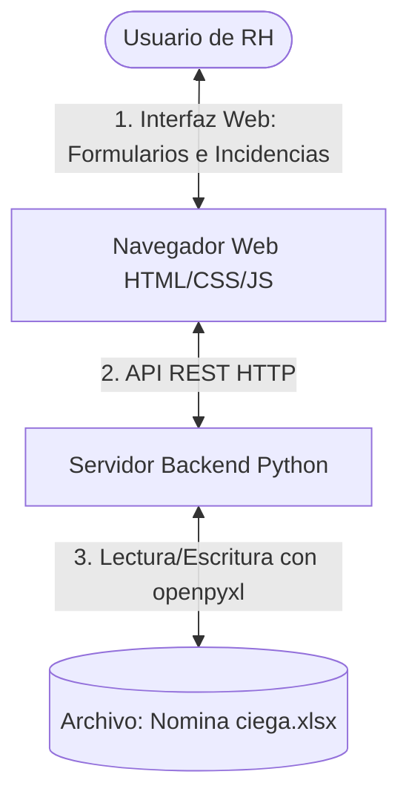

# CRM & Prenómina Inteligente RHM (Edición Conectada a Excel)

Este repositorio contiene la aplicación de control de personal (CRM) y cálculo de prenómina quincenal para los colaboradores de **RHM**. El sistema utiliza el archivo Excel **`Nomina ciega.xlsx`** como su base de datos directa y en tiempo real (Opción A), permitiendo a los usuarios de Recursos Humanos realizar gestiones (altas, bajas, incidencias) desde una interfaz web moderna sin necesidad de interactuar directamente con celdas o conocer fórmulas complejas de Excel.

---

## 📋 Antecedentes y Memoria del Proyecto

### El Problema
RHM maneja un esquema de pago mixto para sus colaboradores (Nominal IMSS + Asimilados + Combustible + Socio + Efectivo + Facturas). El cálculo manual de la nómina quincenal con estas condiciones, sumado a las incidencias (faltas, descuentos por préstamos, retardos), generaba una alta probabilidad de error humano. Las fórmulas de Excel son complejas de mantener (como la integración del salario por antigüedad o topes exentos de vales de despensa) y modificar el Excel directamente por cada incidencia solía corromper los formatos o las sumatorias del libro.

### La Solución (Arquitectura: Opción A)
Se optó por una arquitectura de **Base de Datos Directa en Excel**, donde la interfaz web actúa como una capa visual y un servidor ligero en Python realiza la manipulación del archivo físico en tiempo real utilizando la librería `openpyxl`. 



### Características Principales:
* **Dashboard Ejecutivo**: Resumen de costos de nómina, días descontados, fondos de ahorro y la distribución porcentual de los esquemas de pago.
* **CRM de Colaboradores**: Directorio con buscador y filtros (Empresa, Área, Estado). Formulario para gestionar altas/ediciones y configurar el esquema mixto individual.
* **Módulo de Incidencias**: Captura ágil de faltas, retardos, vacaciones y deducciones adicionales (préstamos), con justificación.
* **Prenómina en Tiempo Real**: Vista interactiva que refleja el formato original del Excel, inyectando fórmulas dinámicas que calculan automáticamente el Salario Diario Integrado (SDI), Vales de Despensa (exentos vía UMA), Fondo de Ahorro (11%), y deducciones proporcionales por faltas.

---

## ⚙️ Requisitos del Sistema

Para ejecutar este proyecto en cualquier computadora, necesitas:
1. **Python 3.7 o superior** instalado en el sistema.
2. Un navegador web moderno (Chrome, Edge, Firefox, Safari).

---

## 🚀 Guía de Instalación y Replicación (Paso a Paso)

Si deseas clonar y seguir trabajando en este proyecto desde cualquier otra computadora, sigue estos sencillos pasos:

### Paso 1: Clonar el Repositorio
Abre tu terminal (PowerShell, CMD o Git Bash) y ejecuta:
```bash
git clone https://github.com/mangoex/rhm-lafher.git
cd rhm-lafher
```

### Paso 2: Instalar Dependencias de Python
Este proyecto utiliza la librería `openpyxl` para leer y escribir directamente en el archivo Excel sin corromper el formato original. Instálala ejecutando:
```bash
pip install openpyxl
```

### Paso 3: Iniciar el Servidor de la API
Ejecuta el servidor backend de Python. Este servidor se encarga de procesar las solicitudes de la web, realizar los cálculos y modificar el archivo Excel:
```bash
python server.py
```
*Deberías ver un mensaje en tu terminal que dice:*  
`Serving RHM CRM & Prenómina on port 8000...`

### Paso 4: Abrir la Aplicación Web
Una vez que el servidor esté corriendo, abre tu navegador web e ingresa a cualquiera de las siguientes direcciones:
* **[http://localhost:8000/](http://localhost:8000/)**
* **[http://127.0.0.1:8000/](http://127.0.0.1:8000/)**

¡Listo! Ya puedes empezar a gestionar el personal y las incidencias.

---

## 📊 Reglas de Negocio e Inyección de Fórmulas

El servidor backend inyecta fórmulas nativas de Excel en las celdas correspondientes. De esta manera, el archivo `Nomina ciega.xlsx` final sigue siendo 100% interactivo, auditable y editable directamente en Microsoft Excel.

| Concepto en Web | Columna en Excel | Fórmula Inyectada | Razón / Lógica |
| :--- | :---: | :--- | :--- |
| **Factor de Integración** | Columna N | `=1 + (15/365) + ((Vacaciones * 0.25) / 365)` | Se calcula automáticamente según la antigüedad del colaborador a la fecha corte. |
| **Salario Diario Integrado** | Columna O | `=M{row} * N{row}` | Multiplicación del Salario Diario por el Factor de Integración de Ley. |
| **Puntualidad e Asistencia** | Columnas Q y R | `=O{row} * 0.10 * 30.4` | 10% del SDI mensualizado (factor de 30.4 días). |
| **Vales de Despensa** | Columna S | `=$S$2 * 0.40 * 30.4` | 40% de la UMA (celda de configuración global `$S$2`) mensualizada. |
| **Fondo de Ahorro** | Columna T | `=IF(L{row}="SI", P{row} * 0.11, 0)` | 11% del Sueldo Nominal, únicamente si la casilla está activa. |
| **Deducción de Faltas** | Columna AG | `=AF{row} / 2 / 15 * (15 - Faltas)` | Descuenta proporcionalmente `1/15` del sueldo bruto quincenal por falta. |

---

## 🔒 Consideraciones y Buenas Prácticas

> [!IMPORTANT]
> **Bloqueo del Archivo Excel en Windows**
> Si tienes el archivo `Nomina ciega.xlsx` abierto en modo edición en Microsoft Excel en tu computadora local, Excel bloqueará la escritura. Si intentas realizar altas o guardar incidencias desde la web con el archivo abierto, la web te mostrará una alerta indicándote que debes **cerrar el archivo Excel local** para poder aplicar los cambios.

> [!WARNING]
> **Usuario Único (Concurrencia)**
> Dado que la base de datos es el propio archivo Excel físico, **solo una persona a la vez** debe realizar modificaciones en la interfaz web para evitar conflictos de escritura o sobrescritura de datos.

---

## ☁️ Flujo de Respaldo Quincenal en GitHub

Para realizar un respaldo seguro de tu prenómina e historial en la nube al finalizar un periodo quincenal:

1. Asegúrate de cerrar el archivo Excel en tu computadora.
2. En la terminal del proyecto, ejecuta:
   ```bash
   # 1. Agregar todos los cambios realizados
   git add .
   
   # 2. Guardar un punto de restauración con un mensaje
   git commit -m "Respaldo quincena: 1ra Quincena de Mayo 2026"
   
   # 3. Subir los cambios a GitHub
   git push origin main
   ```
